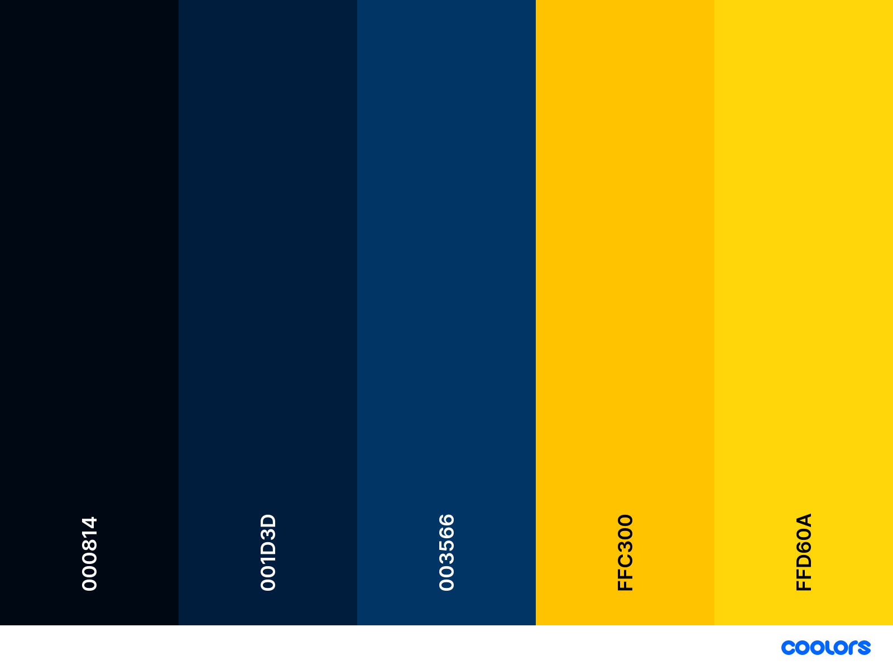

<h1 align="center">
  Ali Taee Portfolio, You are welcome to use this project to build your portfolio site.
</h1>

A few years ago, I built a portfolio with React, GatsbyJs, and SCSS. Recently, I decided to refactor my portfolio with NextJs. During my refactor, I attended a SvelteKit workshop at the DevWorld conference and fell in love ❤️ with Svelte. So, I decided to delete NextJs and refactor it again with SvelteKit. This time, for styles, I chose Tailwind CSS.

I designed this portfolio to be dynamic for easy use. Here are the steps to use this portfolio:

1. Clone it from Github.
2. Replace `src/resume-source.ts` with your details such as name, about, skills, experiences, socials, languages, and education.
3. Replace `src/lib/assets/images/profile-image.jpg` with your photo.
4. Replace `src/lib/assets/resume.pdf` with your resume.

Your portfolio is now ready! You are welcome to:

- Use this portfolio for free
- Edit and modify it as you wish
- Send a pull request to improve this portfolio

There are still some SCSS styles that I plan to refactor into Tailwind CSS. Additionally, I plan to add DaisyUI, improve the design and style on the resume page, and add more pages such as "About Me", "Blog", etc. So, stay tuned.

## Developing

Once you've created a project and installed dependencies with `npm install` (or `pnpm install` or `yarn`), start a development server:

```bash
npm run dev

# or start the server and open the app in a new browser tab
npm run dev -- --open
```

## Building

To create a production version of your app:

```bash
npm run build
```

You can preview the production build with `npm run preview`.

> To deploy your app, you may need to install an [adapter](https://kit.svelte.dev/docs/adapters) for your target environment.

## 🎨 Palette



## 📚 Resource I used for this Portfolio

- [coolors.co](https://coolors.co/) - For Palette Color
- [favicon-generator](https://favicon.io/favicon-generator/) - Text favicon
- [icomoon.io](https://icomoon.io/) - Icon

## Tools and Setup in this project: 🧰

- [Svelte](https://svelte.dev/): Svelte is a UI framework that uses a compiler to let you write breathtakingly concise components that do minimal work in the browser, using languages you already know — HTML, CSS and JavaScript. It’s a love letter to web development.
- [Sveltejs/kit](https://svelte.dev/docs/kit/@sveltejs-kit): SvelteKit is a framework for rapidly developing robust, performant web applications using Svelte.
- [Shiki](https://shiki.matsu.io/): A beautiful yet powerful syntax highlighter
- [mdsvex](https://mdsvex.pngwn.io/): svelte in markdown
- [Tailwindcss](https://tailwindcss.com/): A utility-first CSS framework packed with classes like flex, pt-4, text-center and rotate-90 that can be composed to build any design, directly in your markup.
- [Daisyui](https://rollupjs.org/): daisyUI adds component class names to Tailwind CSS so you can make beautiful websites faster than ever.
- [Prettier](https://prettier.io/): Code formatter
- [Eslint](https://eslint.org/): Code Linter
- [TypeScript](https://www.typescriptlang.org/)
